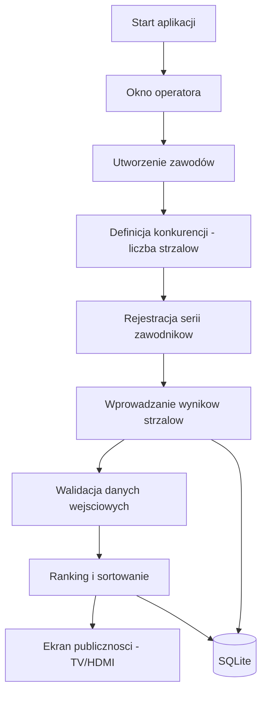

# System Obsługi Konkurencji Strzeleckich (SOKs_LOK)

Aplikacja desktopowa (PySide6) do obsługi operacyjnej zawodów strzeleckich:
tworzenie zawodów i konkurencji, rejestracja serii zawodników, wprowadzanie
wyników strzałów oraz prezentacja rankingu — także na drugim ekranie (TV/HDMI)
dla publiczności.

| | |
|---|---|
| **Nazwa** | System Obsługi Konkurencji Strzeleckich |
| **Skrót** | SOKs_LOK |
| **Platforma** | Windows (desktop) · Python 3.11+ |
| **Interfejs** | PySide6 (Qt) — okno operatora + ekran dla publiczności |
| **Dane** | SQLite (lokalny plik, tworzony przy starcie) |
| **Wydania** | [GitHub Releases](https://github.com/Verter18328/SOKs_LOK/releases) |
| **Licencja** | Własnościowa (proprietary) — projekt nie jest open source |

---

## Wizja projektu

SOKs_LOK powstał na potrzeby konkretnej, lokalnej strzelnicy. Obecny zakres to
**aplikacja operatora pojedynczych zawodów**, ale docelowo projekt zmierza
w stronę **systemu obsługującego całą strzelnicę** (stanowiska, wyświetlacze,
infrastruktura sieciowa, role użytkowników).

Warstwy wrażliwe (konfiguracja sieci, integracje sprzętowe, dane osobowe)
będą rozwijane w sposób oddzielony od publicznie widocznego kodu logiki
aplikacji — zob. [Bezpieczeństwo i dane wrażliwe](#bezpieczeństwo-i-dane-wrażliwe).

---

## Najważniejsze funkcje

| Obszar | Opis |
|--------|------|
| Zawody | Tworzenie i edycja zawodów (nazwa, data, godzina) |
| Konkurencje | Definiowanie konkurencji wraz z liczbą strzałów |
| Zawodnicy | Rejestr zawodników z normalizacją imienia i nazwiska |
| Serie | Rejestracja serii (start zawodnika w danej konkurencji) |
| Wyniki | Wprowadzanie i edycja punktów poszczególnych strzałów z walidacją |
| Ranking | Sortowanie i porządkowanie wyników w interfejsie |
| Ekran publiczności | Wyświetlanie wyników na drugim monitorze (TV/HDMI), cykliczne odświeżanie |
| Baza danych | Lokalna `SQLite` z relacjami i kaskadowym usuwaniem (`ON DELETE CASCADE`) |

---

## Jak to działa



| Krok | Opis |
|------|------|
| 1 | Operator uruchamia aplikację; baza i schemat tworzą się automatycznie przy pierwszym połączeniu |
| 2 | Tworzy zawody (nazwa, data, godzina) |
| 3 | Definiuje konkurencje wraz z liczbą strzałów |
| 4 | Rejestruje serie — przypisuje zawodników do konkurencji w ramach zawodów |
| 5 | Wprowadza wyniki strzałów; dane są walidowane przed zapisem |
| 6 | Wyniki są sortowane i prezentowane jako ranking |
| 7 | Opcjonalnie: ranking jest wyświetlany na drugim ekranie dla publiczności (odświeżanie co kilka sekund) |

---

## Architektura

Projekt jest modularny — logika UI, walidacja i dostęp do danych są rozdzielone.

| Warstwa | Moduły | Odpowiedzialność |
|---------|--------|------------------|
| Punkt wejścia | `operator_ui_handler.py` | Ładowanie okien/dialogów z plików `.ui`, start pętli Qt |
| Sygnały / logika UI | `signals_operator_window.py`, `signals_dialogs.py`, `context_menus.py` | Obsługa zdarzeń, nawigacja, menu kontekstowe list |
| Model i dostęp do danych | `data_manager.py` | Modele (`Zawody`, `Konkurencja`, `Zawodnik`, `Seria`, `Wynik`) i menedżery CRUD |
| Walidacja | `data_validation.py` | Sprawdzanie poprawności danych wejściowych |
| Sortowanie | `sort_methods.py` | Logika rankingu / porządkowania wyników |
| Połączenie z bazą | `database_connection.py` | Wrapper SQLite z auto-rozłączaniem i kaskadami FK |
| Konfiguracja globalna | `globals.py` | Ścieżki (dev/EXE), formaty dat, bootstrap bazy |
| Ekran publiczności | `plebs_display.py` | Drugi monitor (TV/HDMI), cykliczne odświeżanie wyników |

---

## Wymagania

| Komponent | Uwagi |
|-----------|----------------|
| Python | 3.11 lub nowszy (zalecany 64-bit na Windows) |
| Zależności | `pip install -r requirements.txt` (PySide6) |
| Sprzęt (opcjonalnie) | Drugi monitor / TV dla ekranu publiczności |

---

## Instalacja i uruchomienie

### Windows — pakiet z GitHub Releases

Gotowy build (jeden plik `SOKs_LOK.exe`) publikowany jest w sekcji
[GitHub Releases](https://github.com/Verter18328/SOKs_LOK/releases).
Pobierz plik `.exe`, umieść go w dowolnym folderze (np. `C:\Programy\SOKs_LOK\`)
i uruchom. Baza danych `Database_Files/Database.db` powstanie przy pierwszym
uruchomieniu **w tym samym folderze** co `SOKs_LOK.exe`.

Szczegóły pierwszego uruchomienia (antywirus, SmartScreen): zob.
[Antywirus i pierwsze uruchomienie (Windows)](#antywirus-i-pierwsze-uruchomienie-windows).

### Antywirus i pierwsze uruchomienie (Windows)

Aplikacja dystrybuowana jako plik `.exe` (PyInstaller) **nie jest podpisana**
certyfikatem code signing — to typowe dla małych projektów. Przy **pierwszym**
uruchomieniu na Windows może się zdarzyć:

| Objaw | Co to znaczy | Co zrobić |
|-------|--------------|-----------|
| Dłuższe uruchamianie (10–60 s) | Windows Defender lub antywirus skanuje nowy plik | Poczekaj — kolejne uruchomienia są zwykle szybsze |
| **Windows SmartScreen** — „Nieznany wydawca” / „Windows chronił Twój komputer” | Brak podpisu cyfrowego wydawcy | **Więcej informacji** → **Uruchom mimo to** (tylko jeśli pobrałeś plik z [GitHub Releases](https://github.com/Verter18328/SOKs_LOK/releases)) |
| Alert antywirusu (rzadziej) | Fałszywy alarm (false positive) na spakowany PyInstaller | Dodaj folder aplikacji do wyjątków lub zgłoś false positive; pobieraj wyłącznie z oficjalnego release |

**Zalecenia:**

- Pobieraj tylko z oficjalnego repozytorium GitHub (Releases), nie z nieznanych mirrorów.
- Pierwsze uruchomienie onefile może trwać dłużej (rozpakowanie do folderu tymczasowego).
- Aplikacja nie wymaga uprawnień administratora ani dostępu do sieci do podstawowej pracy.

### Uruchomienie ze źródeł (deweloperskie)

Z katalogu, w którym trzymasz projekty:

```bash
git clone https://github.com/Verter18328/SOKs_LOK.git
cd SOKs_LOK
python -m venv .venv
```

Aktywacja środowiska wirtualnego:

| System | Polecenie |
|--------|-----------|
| Windows (PowerShell) | `.\.venv\Scripts\Activate.ps1` |
| Linux / macOS | `source .venv/bin/activate` |

```bash
pip install --upgrade pip
pip install -r requirements.txt
python Code/operator_ui_handler.py
```

> Uruchamiaj z **korzenia repozytorium** (katalog `SOKs_LOK`, tam gdzie leży `README.md`).
> Na Windows, jeśli `python` nie działa, użyj `py -3.11 Code/operator_ui_handler.py`.

> **Uwaga o platformie:** aplikacja jest projektowana pod **Windows** (build EXE,
> a funkcja rozszerzenia drugiego ekranu używa systemowego `DisplaySwitch.exe`).
> Na Linux/macOS część logiki uruchomi się w środowisku deweloperskim, ale
> ekran dla publiczności w trybie rozszerzonym nie zadziała.

### Kolejne uruchomienia

```bash
cd SOKs_LOK
# aktywuj .venv — patrz tabela wyżej
python Code/operator_ui_handler.py
```

### Typowe problemy

| Objaw | Rozwiązanie |
|-------|-------------|
| `ModuleNotFoundError: No module named 'PySide6'` | Aktywuj `.venv` i wykonaj `pip install -r requirements.txt` w tym samym środowisku |
| `No module named 'data_manager'` / `Resources` | Uruchom z katalogu głównego projektu, nie kopiuj plików `.py` poza strukturę repo |
| PowerShell blokuje `Activate.ps1` | Jednorazowo: `Set-ExecutionPolicy -ExecutionPolicy RemoteSigned -Scope CurrentUser` |
| SmartScreen blokuje `SOKs_LOK.exe` | Pobierz z [GitHub Releases](https://github.com/Verter18328/SOKs_LOK/releases); **Więcej informacji** → **Uruchom mimo to** — patrz [Antywirus i pierwsze uruchomienie](#antywirus-i-pierwsze-uruchomienie-windows) |
| Długi start przy pierwszym uruchomieniu EXE | Skan antywirusa — poczekaj; kolejne starty są zwykle szybsze |

---

## Baza danych

Domyślna lokalizacja: `Database_Files/Database.db` (ignorowana przez Git).

| Tabela | Zawartość |
|--------|-----------|
| `zawody_lista` | Zawody (nazwa, data, godzina) |
| `konkurencje_lista` | Konkurencje (liczba strzałów itd.) |
| `zawody_konkurencje_link` | Powiązanie zawodów z konkurencjami (relacja N:N) |
| `zawodnicy` | Zawodnicy |
| `starty` | Serie / starty zawodników w konkurencji |
| `strzaly` | Pojedyncze strzały (numer, punkty) |

Relacje rodzic → dziecko korzystają z `ON DELETE CASCADE` / `ON UPDATE CASCADE`,
aby usuwanie i zmiana ID nie kończyły się błędem `FOREIGN KEY constraint failed`.

---

## Struktura repozytorium

```
SOKs_LOK/
├─ Code/                       # logika aplikacji
│  ├─ operator_ui_handler.py   # punkt wejścia (okna i dialogi)
│  ├─ signals_operator_window.py
│  ├─ signals_dialogs.py
│  ├─ context_menus.py
│  ├─ data_manager.py          # modele i menedżery danych (CRUD)
│  ├─ data_validation.py
│  ├─ sort_methods.py
│  ├─ database_connection.py   # wrapper SQLite
│  ├─ globals.py               # konfiguracja, ścieżki, formaty dat
│  └─ plebs_display.py         # ekran dla publiczności (TV/HDMI)
├─ Ui_Files/                   # widoki Qt Designer (.ui)
├─ Resources/                  # zasoby (logo) + resources_rc.py
├─ Database_Files/             # baza SQLite (tworzona przy starcie)
├─ requirements.txt            # zależności uruchomieniowe
├─ requirements-dev.txt        # PyInstaller (opcjonalnie, build lokalny)
├─ CHANGELOG.md                # historia wydaniań
├─ LICENSE                     # licencja własnościowa
├─ THIRD_PARTY_NOTICES.md      # noty o komponentach zewnętrznych
└─ README.md
```

---

## Status projektu

| Zrobione | Planowane |
|----------|-----------|
| Tworzenie/edycja zawodów i konkurencji | Formalne „zamknięcie” zawodów w aplikacji |
| Rejestracja serii i zawodników | Druk i eksport wyników |
| Wprowadzanie i walidacja wyników strzałów | Ekran wyników w QML (HDMI) |
| Ranking i sortowanie w UI | Wyszukiwanie zawodów po nazwie i dacie |
| Ekran dla publiczności (drugi monitor) | — |
| Lokalna baza SQLite z kaskadami FK | Rozbudowa do systemu całej strzelnicy |

---

## Bezpieczeństwo i dane wrażliwe

- Baza `Database_Files/Database.db` jest **ignorowana przez Git** — nie commituj
  bazy ani jej kopii zapasowych (zawiera dane osobowe zawodników).
- Nie umieszczaj w repozytorium sekretów, danych logowania ani konfiguracji
  produkcyjnej — także w wersji „deweloperskiej”.
- Przy rozwoju do systemu całej strzelnicy konfiguracja sieci i integracje
  sprzętowe powinny być trzymane poza publiczną częścią repozytorium.
- Wdrożenia przetwarzające dane osobowe zawodników u podmiotów trzecich
  wymagają osobnego uregulowania kwestii ochrony danych (RODO).

---

## Licencja

Copyright © 2025–2026 **Verter18328**. Wszelkie prawa zastrzeżone.

Projekt **nie jest open source**. Publiczna dostępność kodu w repozytorium nie
udziela prawa do kopiowania, modyfikacji ani dystrybucji bez pisemnej zgody
właściciela. Wdrożenia u podmiotów trzecich (np. inne strzelnice) wymagają
odrębnej umowy licencyjnej.

- Pełna licencja: [`LICENSE`](LICENSE)
- Komponenty zewnętrzne (PySide6/Qt, SQLite): [`THIRD_PARTY_NOTICES.md`](THIRD_PARTY_NOTICES.md)

---

## Informacje o projekcie

| Pole | Wartość |
|------|---------|
| Repozytorium | https://github.com/Verter18328/SOKs_LOK |
| Wydania | https://github.com/Verter18328/SOKs_LOK/releases |
| Historia zmian | [`CHANGELOG.md`](CHANGELOG.md) |
| Autor | [Verter18328](https://github.com/Verter18328) |
| Licencja | Własnościowa — [`LICENSE`](LICENSE) |
